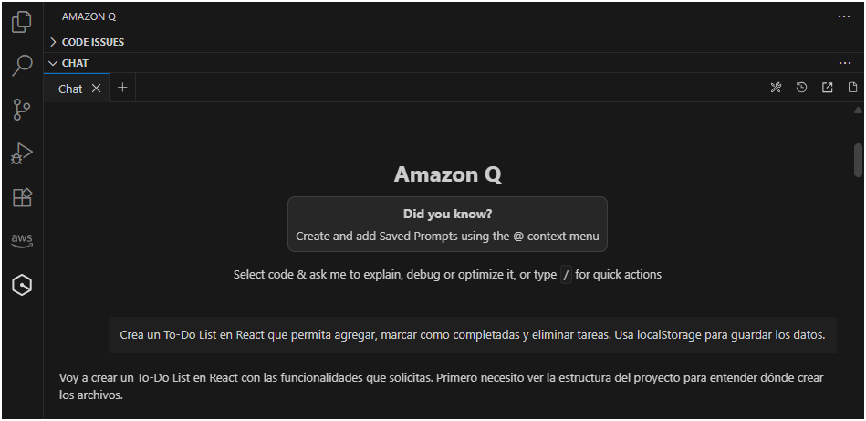
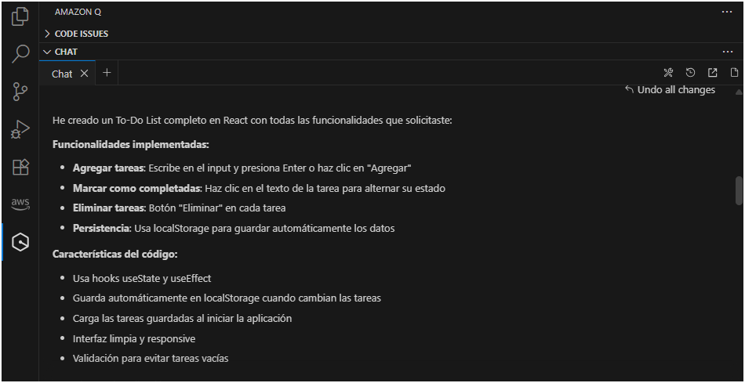
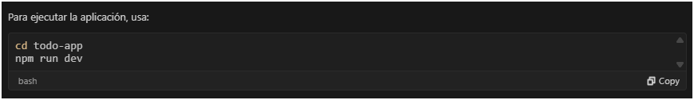
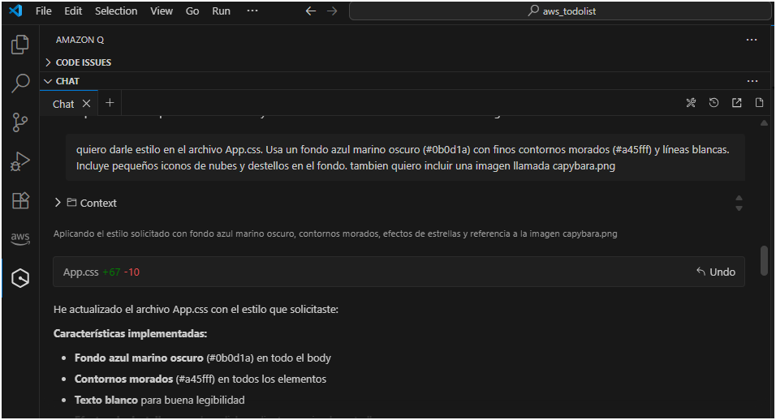
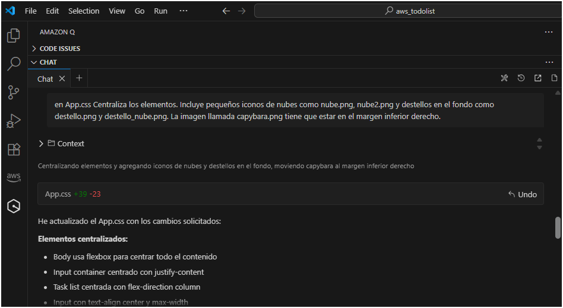
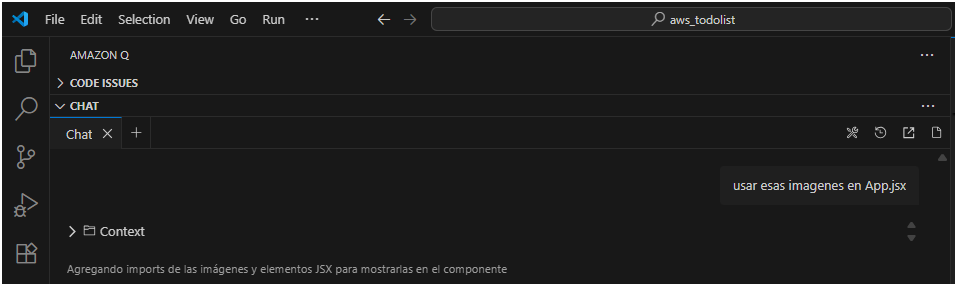
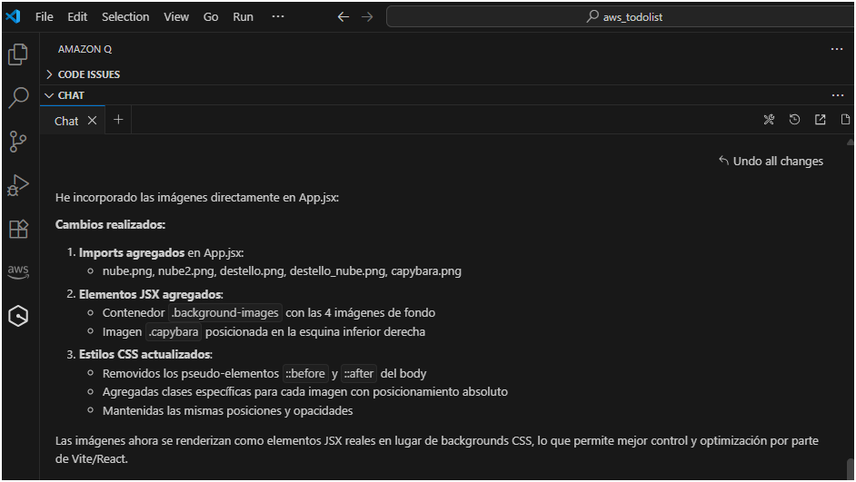

# 🌙 To-Do List App: Espacio Capybara

Una aplicación de lista de tareas con un diseño espacial nocturno y elementos decorativos de nubes, destellos y un capybara 🦦, construida con React y Vite.

## ✨ Características principales

- **Agregar tareas**: Escribe en el input y presiona Enter o haz clic en "Agregar".
- **Marcar como completadas**: Haz clic en el texto de la tarea para alternar su estado.
- **Eliminar tareas**: Botón "Eliminar" en cada tarea.
- **Persistencia**: Los datos se guardan automáticamente en localStorage.
- **Diseño único**: Fondo azul marino con finos contornos morados y efectos visuales de nubes y destellos.
- **Decorativo**: Capybara en el margen inferior derecho y pequeños iconos animados para un look divertido y nocturno.

## 🖼️ Capturas de pantalla de la conversación con Amazon Q Developer

A continuación se muestran las capturas que documentan toda la conversación y el proceso de desarrollo:

### 1️⃣ Solicitud inicial
Pedí a Amazon Q Developer crear un To-Do List en React que permita agregar, marcar como completadas y eliminar tareas, usando localStorage.



### 2️⃣ Implementación sugerida
Amazon Q me muestra cómo implementó la lógica de la aplicación, incluyendo el manejo de tareas y el estado.



### 3️⃣ Instrucciones de ejecución
Me explica cómo ejecutar la aplicación localmente, incluyendo instalación de dependencias y comandos de Vite.



### 4️⃣ Estilos y diseño
Solicité un estilo especial en App.css, con fondo azul marino oscuro (#0b0d1a), contornos morados (#a45fff), líneas blancas, iconos de nubes y destellos, y una imagen capybara.png.



### 5️⃣ Posicionamiento de elementos
Indiqué que los elementos deben estar centrados, con iconos de nubes (nube.png, nube2.png) y destellos (destello.png, destello_nube.png). La capybara debe estar en el margen inferior derecho.



### 6️⃣ Uso de imágenes en App.jsx
Amazon Q me muestra cómo incluir correctamente todas las imágenes en el componente principal App.jsx.



### 7️⃣ Resultados finales
Captura de los cambios finales realizados, mostrando la app con estilo completo y funcionalidades implementadas.



## 🚀 Instalación y ejecución

1. **Clonar el repositorio**:
```bash
git clone https://github.com/TU_USUARIO/todo-app.git
cd todo-app
```

2. **Instalar dependencias**:
```bash
npm install
```

3. **Ejecutar la aplicación**:
```bash
npm run dev
```

4. **Abrir en el navegador**:
```
http://localhost:5173
```

## 🎨 Diseño visual

- **Fondo**: Azul marino oscuro (#0b0d1a)
- **Contornos y elementos**: Morado (#a45fff) y líneas blancas
- **Decoración**: Nubes (nube.png, nube2.png) y destellos (destello.png, destello_nube.png)
- **Capybara decorativa**: capybara.png en el margen inferior derecho
- **Centrado y responsive**: Elementos adaptables a distintos tamaños de pantalla

## 📁 Estructura del proyecto

```
src/
├── App.jsx
├── App.css
├── main.jsx
└── assets/
    ├── nube.png
    ├── nube2.png
    ├── destello.png
    ├── destello_nube.png
    ├── capybara.png
    ├── 1.png
    ├── 2.png
    ├── 3.png
    ├── 4.png
    ├── 5.png
    ├── 6.png
    └── 8.png
```

## 🔧 Funcionamiento técnico

### Estado y lógica
- `tasks`: Array de objetos `{ id, text, completed }`
- `inputValue`: Valor del campo de entrada

### Persistencia automática
```javascript
useEffect(() => {
  const savedTasks = localStorage.getItem('todoTasks');
  if (savedTasks) setTasks(JSON.parse(savedTasks));
}, []);

useEffect(() => {
  localStorage.setItem('todoTasks', JSON.stringify(tasks));
}, [tasks]);
```

### Funciones principales
- **addTask()**: Agrega una nueva tarea con ID único
- **toggleTask(id)**: Alterna completado/pendiente
- **deleteTask(id)**: Elimina la tarea correspondiente

## 🎯 Uso de la aplicación

1. **Agregar**: Escribe en el input y presiona Enter o "Agregar".
2. **Completar**: Haz clic en el texto de la tarea.
3. **Eliminar**: Haz clic en el botón "Eliminar".
4. **Persistencia**: Los cambios se mantienen al recargar la página.

## 🛠️ Tecnologías utilizadas

- React 18
- Vite
- CSS3 con efectos visuales
- localStorage para almacenamiento local

## 📱 Responsive

- Elementos centrados y adaptables
- Optimizado para escritorio y móviles